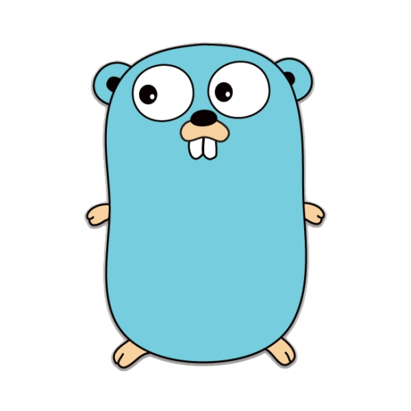

<h2>Hi, I'm Moura!</h2>

 

#### About Me
- Software developer with focus on Backend developement.
- Game development enthusiast.
- Study and practice. Learn by doing.

#### Development:

  
  
  

####

  
  

####

  
    
  

#### Stats:  

  <!-- thropy -->
  

    
  

  
  <!-- status codes -->
  

    
    
  

